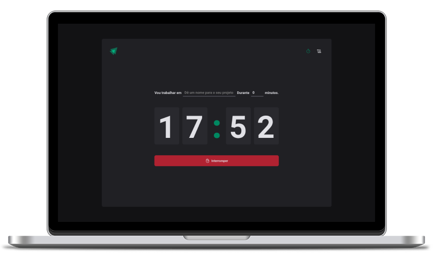

   

# Timer Application

  
  
  

 
  

 

## 🚀 Features

1. **Create new timer**: Users can create new timers and name them according to their preference. Users can set the desired time for the timer in hours, minutes, and seconds.

2. **Interrupt timer**: Users can interrupt the timer if they need to pause their task or take a break.

3. **View timer story with statuses**: Users can view their timer history and see the status of each timer. The status can be completed, interrupted, or in progress.

 

## 🛠️ Technologies

This application is built using the following technologies:

- [React](https://reactjs.org/)
- [TypeScript](https://www.typescriptlang.org/)
- [Vite](https://vitejs.dev/)
- [React Hooks](https://reactjs.org/docs/hooks-intro.html)
- [React Form](https://react-hook-form.com/)

 

## 🚀 Getting Started

Follow these steps to get started with the Timer Application:

1. Clone the repository to your local machine.

2. Install dependencies using the command `npm install`.

3. Start the development server using the command `npm run dev`.

4. In your browser, navigate to `http://localhost:3000` to access the application.

5. Use the application by creating new timers, interrupting timers, and viewing timer history.

 

## 🚀 Creating a Production Build

To create a production build of the Timer Application, follow these steps:

1. Run the command `npm run build`.

2. The production-ready application will be generated in the `dist` directory.

3. Serve the production build using a server of your choice.

 

## 🤝 Contributing

Contributions to this project are welcome. To contribute, follow these steps:

1. Fork the repository.

2. Create a new branch.

3. Make your changes and commit them.

4. Push to the new branch.

5. Create a pull request.

 

## 📝 License

This project is licensed under the MIT License.
